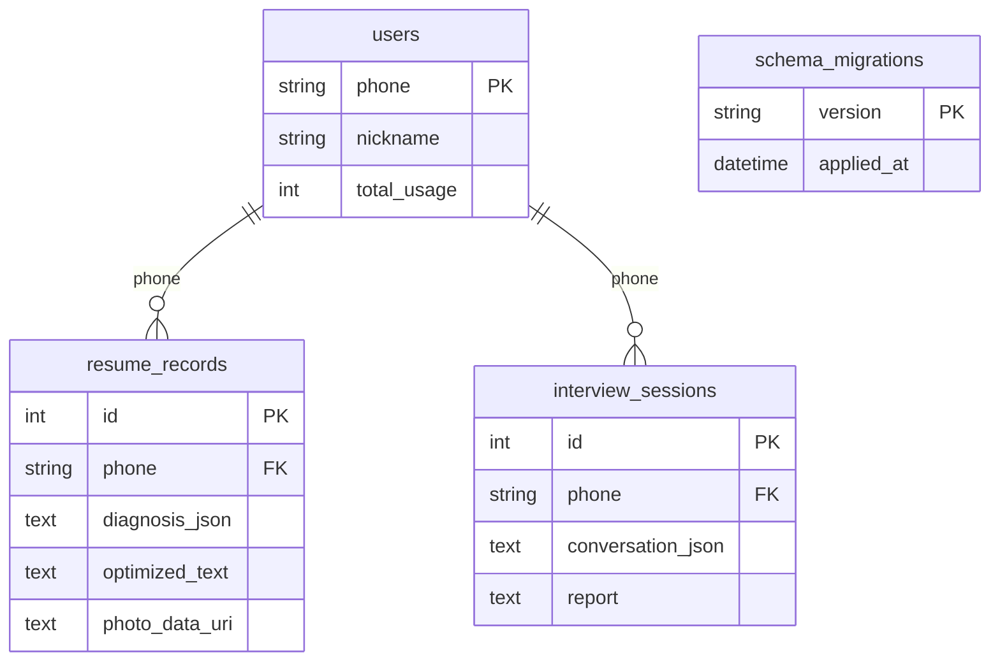

# 数据模型、迁移与备份恢复

核验日期：2026-09-24。对应当前工作区的 SQLAlchemy 实体、仓储和历史服务；SQLite 是业务记录的持久化来源。

## 1. 关系与存储边界



每个用户可有多条诊断和多轮面试。面试报告直接保存在对应会话的 `report` 字段，没有独立报告表；简历诊断明细保存在 `diagnosis_json`。会话保存简历文本快照，不依赖某条诊断的外键，所以删除上传副本不影响历史正文。

验证码、Token 和每日配额位于内存或可配置 Redis，不在 SQLite 中。`users.total_usage` 是既有统计字段，当前配额服务不以它作为每日计数来源。ChromaDB 存储题库与向量；上传、PDF/Word 导出及 Gradio 缓存是独立文件。单个 SQLite 快照不包含这些外部状态。

## 2. 字段

三张业务表都有 `created_at`、`updated_at`：数据库默认 `CURRENT_TIMESTAMP`，ORM 更新时设置 `updated_at`。SQLite 读取的无时区时间在历史服务中按 UTC 解释，再转成配置时区展示；默认 Asia/Hong_Kong。

### users

| 字段 | 类型与约束 | 含义 |
| --- | --- | --- |
| `phone` | VARCHAR(11)，主键，长度检查为 11 | 用户标识；号码格式还由业务层校验 |
| `nickname` | VARCHAR(50)，非空，ORM 默认“求职者” | 昵称 |
| `total_usage` | INTEGER，非空，ORM 默认 0 | 保留的统计字段，不代表当日配额 |

### resume_records

| 字段 | 类型与默认值 | 含义 |
| --- | --- | --- |
| `id`、`phone` | INTEGER 主键；用户外键，非空 | 记录编号与归属 |
| `original_text`、`target_position` | TEXT；VARCHAR(100)，非空 | 诊断输入与目标岗位 |
| `score` | INTEGER，0～100 检查约束 | 匹配分数 |
| `missing_keywords_json` | TEXT，ORM 默认 `[]` | 缺失关键词数组 |
| `suggestions`、`optimized_text` | TEXT，非空 | 修改建议与可编辑优化稿 |
| `photo_data_uri` | TEXT，默认空字符串 | 内嵌照片，可随 SQLite 一起备份 |
| `policy_version` | VARCHAR(64)，默认 `legacy-v1` | 诊断策略版本 |
| `grade` | VARCHAR(8)，默认空字符串 | 诊断等级 |
| `diagnosis_json` | TEXT，默认 `{}` | 结构化诊断、维度与证据 |
| `template_id` | VARCHAR(64)，默认 `classic` | 选定的本地导出版式 |

### interview_sessions

| 字段 | 类型与默认值 | 含义 |
| --- | --- | --- |
| `id`、`phone` | INTEGER 主键；用户外键，非空 | 会话编号与归属 |
| `position` | VARCHAR(100)，非空 | 目标岗位 |
| `job_description`、`resume_text` | TEXT，ORM 默认空字符串 | JD 与简历快照 |
| `status` | VARCHAR(20)，ORM 默认 `created` | 业务推进到 `in_progress`、`completed` |
| `current_question` | TEXT，ORM 默认空字符串 | 当前问题 |
| `question_rounds` | INTEGER，ORM 默认 0，非负约束 | 已推进的主问题轮数 |
| `follow_up_count` | INTEGER，ORM 默认 0 | 当前主问题追问次数 |
| `conversation_json` | TEXT，ORM 默认 `[]` | 问题、回答、反馈及跳过标记 |
| `report` | TEXT，ORM 默认空字符串 | 完成后的结构化报告 JSON，包括评分、评价、盲区与建议 |
| `difficulty` | VARCHAR(16)，默认 `standard` | 开始时固定的难度 |
| `mode` | VARCHAR(32)，默认 `standard_live` | 面试模式 |
| `feedback_mode` | VARCHAR(16)，默认 `live` | 即时或延迟反馈 |
| `policy_version` | VARCHAR(64)，默认 `interview-standard-v1` | 面试策略版本 |
| `question_plan_json` | TEXT，默认 `[]` | 开始时固定的考察计划 |

SQLite 不强制执行 VARCHAR 的长度，也不校验这些 TEXT 字段中的 JSON 结构；业务层承担输入与模型响应校验。历史服务对旧记录或损坏 JSON 提供空结构降级。枚举状态与追问上限由业务层控制。

### schema_migrations

`version` 是 VARCHAR(100) 主键，`applied_at` 默认当前时间。现有三个标记为 `2026-09-21-m1-policy-metadata`、`2026-09-22-interview-difficulty`、`2026-09-23-resume-photo`。标记仅用于审计；初始化仍检查实际列是否存在，不单凭标记跳过迁移。历史复合索引通过 `CREATE INDEX IF NOT EXISTS` 补齐，当前没有单独版本标记。

## 3. 事务、隔离与索引

- `Database.session()` 成功提交，异常回滚，并最终关闭 Session。外键开启，SQLite 使用 WAL 与 30 秒忙等待；SQLAlchemy 连接超时同样为 30 秒。
- 用户删除通过 ORM 级联及数据库 `ON DELETE CASCADE` 删除所属简历和面试。仓储删除函数是内部接口，不代替调用方的鉴权；目前没有用户自助删除页面。
- 历史入口先校验 Token，再使用手机号过滤。详情使用“编号 + 当前手机号”查询；不存在和他人记录均拒绝。
- 最近历史查询：`WHERE phone = ? ORDER BY created_at DESC, id DESC LIMIT 5`。相同秒内写入用 `id` 保证稳定排序。
- 两张历史表分别使用 `ix_resume_records_user_history`、`ix_interview_sessions_user_history`，列顺序均为 `(phone, created_at, id)`；SQLite 反向扫描即可满足倒序，无须临时排序。原有 `phone` 单列索引保留。
- 9/24 测试捕获仓储实际执行的 SQL，再运行 `EXPLAIN QUERY PLAN`；新建库和旧库升级均使用对应复合索引，未出现 `TEMP B-TREE`。

当前初始化锁、面试锁和 Gradio 队列仍有进程内状态，部署维持单实例、单 worker。

## 4. 兼容迁移

启动或业务服务调用 `initialize()` 时，先创建缺失表，再按实际结构补充策略、难度、照片字段，并创建复合索引。迁移不删列、不重建业务表，旧行通过默认值保持可读。仅支持已有合法 MVP 表结构的兼容升级；不把任意损坏或缺少基础字段的数据库视为可修复输入。

9/24 验证使用独立 SQL 构造的完整旧库，含 2 用户、14 份简历、14 轮已完成面试及报告；连续初始化两次，逐字段比对旧数据，验证历史排序、默认策略、完整问答和报告，以及跨用户拒绝。合成输入与日常数据库隔离。

升级前先生成快照。当前没有向下迁移工具；回退代码时应恢复与旧代码匹配的备份，避免仅替换程序而留下不匹配的数据结构。

## 5. 备份与独立恢复

在项目根目录执行，备份路径必须是尚不存在的新文件：

```powershell
.\.venv\Scripts\python.exe scripts\backup_database.py data\backups\before-upgrade.db
```

默认来源是配置中的 `DATABASE_URL`；可显式选择另一个库：

```powershell
.\.venv\Scripts\python.exe scripts\backup_database.py data\backups\isolated.db --database-url sqlite:///tmp/source.db
```

工具以只读连接打开源库，通过 SQLite 在线备份 API 复制已提交的 WAL 数据，完成后执行 `integrity_check`。同路径、已存在目标、非文件库和缺失源库均被拒绝；备份异常时移除本次创建的残留目标。不要直接复制运行中的主 `.db` 文件。

独立恢复示例（先选定一个不存在的演练目录，避免误覆盖）：

```powershell
New-Item -ItemType Directory -Path tmp\restore-drill -ErrorAction Stop
Copy-Item -LiteralPath data\backups\before-upgrade.db -Destination tmp\restore-drill\restored.db
$env:DATABASE_URL = 'sqlite:///tmp/restore-drill/restored.db'
$env:DATA_DIR = "$PWD\tmp\restore-drill"
.\.venv\Scripts\python.exe -m pbl_jobs_finder
```

在独立 PowerShell 窗口执行演练，结束后关闭该窗口，避免恢复库配置影响日常启动。确认结构初始化、`integrity_check`、`foreign_key_check`、用户与业务行数、原字段内容和历史读取都通过，再决定是否正式切换。实际切换前停止应用，备份当前运行数据，在新的数据目录恢复，并更新配置；不要将快照直接覆盖到仍有活动连接或旧 WAL 的原库上。

自动化复现迁移、查询计划、WAL 快照和恢复后的业务访问：

```powershell
.\.venv\Scripts\python.exe -m unittest discover -s tests -p test_data_storage.py -v
.\.venv\Scripts\python.exe -m unittest discover -s tests -p test_backup_database.py -v
```

9/24 还对日常库生成真实快照并在独立临时目录恢复：5 用户、17 份简历、10 轮面试，所有原字段一致、完整性通过、外键违规 0；全部历史详情可读取。只在恢复副本执行初始化，未改写源库业务数据。详见工程验收记录。

## 6. 保留与后续迁移

业务记录当前长期保留，展示“最近 5 条”不等于删除旧记录。上传暂存副本由上下文管理器清理；照片在简历行内，随该记录删除。9/26 已补齐新生成 PDF/Word 的 24 小时下载有效期和定期清理，以及 Gradio 缓存清理；删除数据库行后下载归属查询也会拒绝，文件按期限回收。旧文件和备份不自动删除，详见 [文件生命周期](storage.md)。备份包含个人信息，应使用受限目录保存，不提交 Git；`data/backups/` 已被忽略。

SQLite 快照只恢复业务记录。完整环境恢复还需分别处理 ChromaDB、导出文件以及启用时的 Redis 持久化；没有跨存储全局事务快照。Redis 重启恢复按 9/25 专项验收。

当明确需要多实例，或实测写入锁等待影响核心业务时再评估 PostgreSQL/MySQL：核对驱动、字段/时间/JSON 类型、约束、索引、事务和迁移工具，先完成逐用户行数与字段校验及回滚演练。本阶段不并行维护第二条数据库路径。
