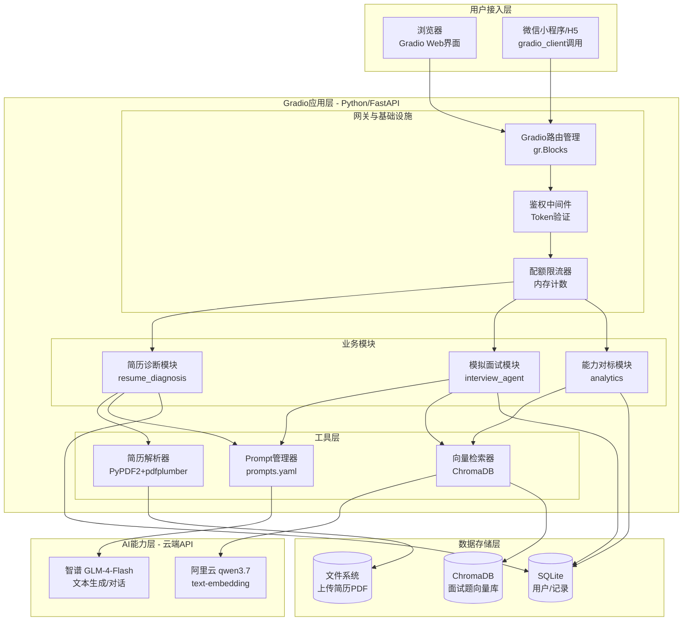
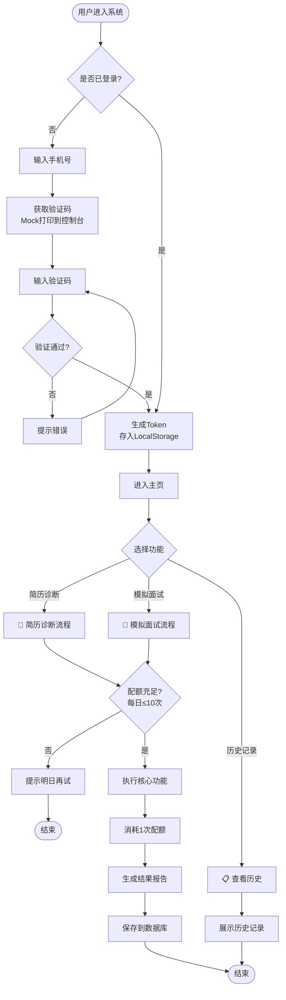
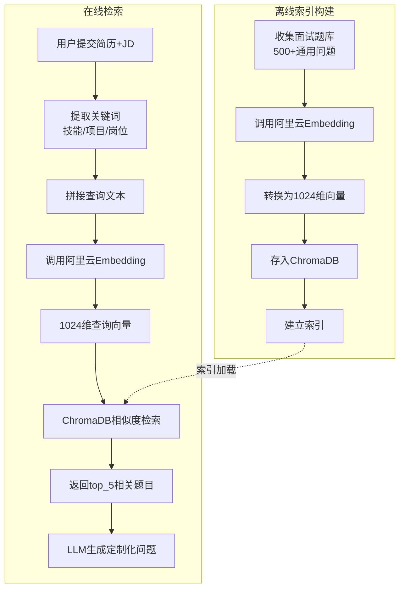
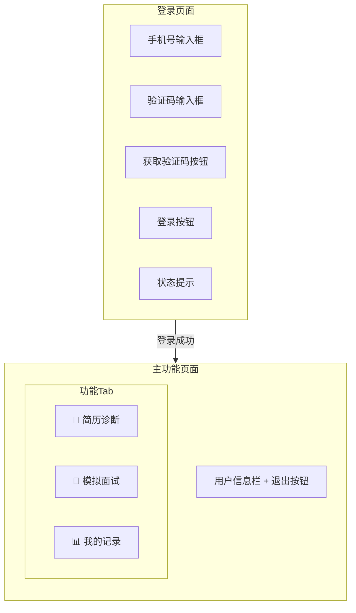
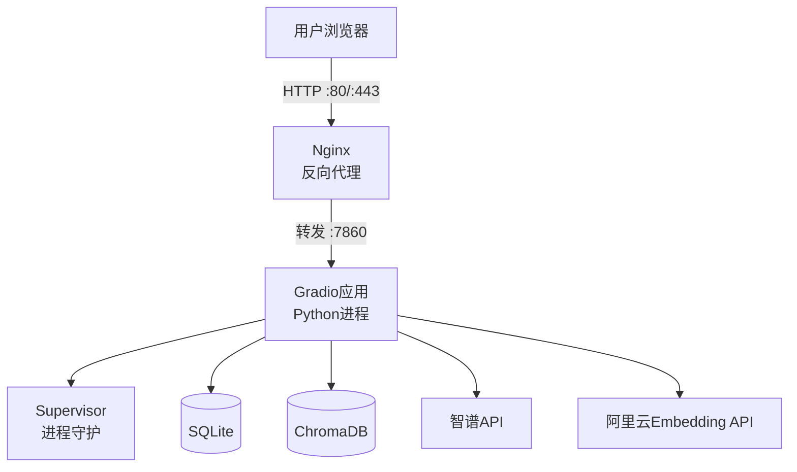

# AI 求职助手 MVP 需求文档与设计文档

---

# 第一部分：需求文档

## 1. 项目概述

### 1.1 项目背景

当前就业市场竞争激烈，求职者面临三大核心困境：

| 痛点 | 具体表现 | 影响 |
| :--- | :--- | :--- |
| **简历投递无回应** | 海投100份简历，面试邀约不足5个 | 简历关键词与JD不匹配，被ATS系统过滤 |
| **面试准备低效** | 背了八股文，遇到场景题就卡壳 | 缺乏针对自身简历的定制化练习 |
| **求职过程焦虑** | 不知道自己在市场中的定位 | 缺乏客观的能力评估和反馈 |

### 1.2 产品定位

**一句话描述**：一个AI驱动的求职助手，帮助求职者优化简历、模拟面试、提升求职成功率。

**目标用户**：
- 应届毕业生（首次求职）
- 工作1-5年的职场人（跳槽）
- 转行求职者（跨领域求职）

**核心价值主张**：
- 让简历通过率提升3倍
- 把真实面试提前演练10遍
- 用数据消除求职焦虑

### 1.3 MVP范围界定

| 优先级 | 功能 | 说明 |
| :--- | :--- | :--- |
| **P0（必须）** | 手机号验证码登录 | 极简鉴权，Token存LocalStorage |
| **P0（必须）** | 简历PDF上传与解析 | 提取纯文本，支持手动粘贴兜底 |
| **P0（必须）** | AI简历诊断 | 匹配度评分 + 缺失关键词 + 优化建议 |
| **P0（必须）** | AI简历优化（STAR法则） | 重写项目经历，嵌入量化指标 |
| **P0（必须）** | 单轮/多轮模拟面试 | AI提问 + 用户回答 + AI追问 |
| **P1（重要）** | 面试报告生成 | 能力评分 + 知识盲区 + 改进建议 |
| **P1（重要）** | 每日配额限制 | 10次/天，软限制 |
| **P1（重要）** | 历史记录查询 | 查看历史诊断和面试记录 |
| **P2（后续）** | 能力对标分析 | 市场百分位对比 |
| **P3（不做）** | 支付系统 | 人工发体验码替代 |
| **P3（不做）** | 微信小程序 | 先用Gradio Web验证 |

---

## 2. 功能需求

### 2.1 用户登录模块

| 需求编号 | 需求描述 | 优先级 |
| :--- | :--- | :--- |
| F-AUTH-01 | 用户可通过手机号+验证码登录 | P0 |
| F-AUTH-02 | 验证码6位数字，5分钟有效 | P0 |
| F-AUTH-03 | MVP阶段验证码打印到控制台（Mock） | P0 |
| F-AUTH-04 | 登录成功后生成Token，存入LocalStorage | P0 |
| F-AUTH-05 | Token用于后续所有API调用的身份识别 | P0 |
| F-AUTH-06 | 支持退出登录 | P1 |

**验收标准**：
- 输入11位手机号，点击"获取验证码"，控制台打印6位验证码
- 输入正确验证码后，登录成功，显示主功能界面
- 输入错误验证码，提示错误并允许重试

### 2.2 简历诊断模块

| 需求编号 | 需求描述 | 优先级 |
| :--- | :--- | :--- |
| F-RESUME-01 | 支持上传PDF格式简历（≤10MB） | P0 |
| F-RESUME-02 | 自动解析PDF，提取纯文本 | P0 |
| F-RESUME-03 | 解析失败时，支持手动粘贴文本 | P0 |
| F-RESUME-04 | 用户输入目标岗位名称 | P0 |
| F-RESUME-05 | AI输出匹配度评分（0-100） | P0 |
| F-RESUME-06 | AI输出缺失关键词清单 | P0 |
| F-RESUME-07 | AI输出优化建议（STAR法则） | P0 |
| F-RESUME-08 | AI输出优化后的项目经历示例 | P0 |
| F-RESUME-09 | 诊断结果保存到数据库 | P1 |
| F-RESUME-10 | 支持重新诊断 | P1 |

**验收标准**：
- 上传一份真实简历PDF，30秒内返回诊断结果
- 诊断结果包含：评分、缺失关键词、优化建议、STAR示例
- 评分合理（60-90分区间），建议具体可操作

### 2.3 模拟面试模块

| 需求编号 | 需求描述 | 优先级 |
| :--- | :--- | :--- |
| F-INTERVIEW-01 | 用户选择岗位类型或输入岗位名称 | P0 |
| F-INTERVIEW-02 | 可选粘贴岗位JD | P0 |
| F-INTERVIEW-03 | 可选粘贴简历核心内容 | P0 |
| F-INTERVIEW-04 | AI生成第一道定制化面试题 | P0 |
| F-INTERVIEW-05 | 用户输入回答，AI给予反馈 | P0 |
| F-INTERVIEW-06 | 回答不完整时，AI自动追问（≤3次） | P1 |
| F-INTERVIEW-07 | 支持多轮问答（默认5题） | P0 |
| F-INTERVIEW-08 | 面试结束后生成面试报告 | P1 |
| F-INTERVIEW-09 | 报告包含：能力评分、知识盲区、改进建议 | P1 |
| F-INTERVIEW-10 | 面试记录保存到数据库 | P1 |
| F-INTERVIEW-11 | 支持重新开始面试 | P1 |

**验收标准**：
- 选择"Java后端开发工程师"，AI生成结合简历的面试题
- 回答后AI给予反馈，不完整时追问
- 5轮后生成完整面试报告

### 2.4 配额管理模块

| 需求编号 | 需求描述 | 优先级 |
| :--- | :--- | :--- |
| F-QUOTA-01 | 每个用户每日免费使用10次 | P1 |
| F-QUOTA-02 | 简历诊断和模拟面试共享配额 | P1 |
| F-QUOTA-03 | 配额用完后提示"明日再试" | P1 |
| F-QUOTA-04 | 配额每日00:00重置 | P1 |

### 2.5 历史记录模块

| 需求编号 | 需求描述 | 优先级 |
| :--- | :--- | :--- |
| F-HISTORY-01 | 查看最近5条简历诊断记录 | P1 |
| F-HISTORY-02 | 查看最近5条模拟面试记录 | P1 |
| F-HISTORY-03 | 显示记录的时间、岗位、评分/轮数 | P1 |

---

## 3. 非功能需求

| 类别 | 需求 | 指标 |
| :--- | :--- | :--- |
| **性能** | 简历诊断响应时间 | ≤30秒 |
| **性能** | 模拟面试单轮响应时间 | ≤15秒 |
| **性能** | 页面加载时间 | ≤3秒 |
| **并发** | 同时在线用户 | ≥50人 |
| **可用性** | 服务可用性 | ≥99% |
| **成本** | 月度运营成本 | ≤¥200 |
| **安全** | 用户数据隔离 | Token鉴权 |
| **兼容** | 浏览器支持 | Chrome/Edge/Safari最新版 |
| **可维护** | 代码结构 | 模块化，单文件≤400行 |

---

# 第二部分：设计文档

## 1. 系统架构设计

### 1.1 整体架构图



### 1.2 技术栈选型

| 层级 | 组件 | 选型 | 选型理由 |
| :--- | :--- | :--- | :--- |
| **前端** | UI框架 | Gradio 4.36.1 | 一行代码生成UI，天然支持API |
| **后端** | Web框架 | FastAPI（Gradio内置） | 异步高性能，自动API文档 |
| **语言** | 开发语言 | Python 3.10+ | AI生态完善，开发效率高 |
| **LLM** | 文本生成 | 智谱 GLM-4-Flash | 当前免费，中文能力优秀 |
| **Embedding** | 向量化 | 阿里云 qwen3.7-text-embedding | 免费100万Token，1024维 |
| **向量库** | 语义检索 | ChromaDB | 轻量级，嵌入式，无需独立部署 |
| **数据库** | 结构化存储 | SQLite | 零配置，单文件，够用 |
| **PDF解析** | 文档处理 | PyPDF2 + pdfplumber | 纯本地，无API调用费 |
| **部署** | 服务器 | 阿里云ECS 2核4G | 最低配即可，成本可控 |

### 1.3 技术决策记录

| 决策点 | 结论 | 备选方案 | 决策理由 |
| :--- | :--- | :--- | :--- |
| 前端选型 | Gradio | Vue/React | MVP阶段零前端代码，快速验证 |
| LLM选型 | 智谱GLM-4-Flash | 文心/通义 | 当前免费，中文强，响应快 |
| Embedding | 阿里云qwen3.7 | OpenAI text-embedding-3-small | 免费额度充足，国内访问稳定 |
| 向量库 | ChromaDB | Milvus/Pinecone | 轻量、嵌入、零部署成本 |
| 数据库 | SQLite | PostgreSQL/MySQL | 单文件、够用、无需运维 |
| 意图识别 | 不用（用Tab按钮） | LLM意图分类 | MVP阶段任务型产品，按钮更直接 |
| 多模态模型 | 暂不引入 | WeMM-Embedding | 不增加MVP复杂度和成本 |

---

## 2. 模块设计

### 2.1 项目目录结构

```
job-assistant-mvp/
│
├── app.py                          # 应用主入口（Gradio启动文件）
├── requirements.txt                # Python依赖清单
├── .env                            # 环境变量（API Key等）
├── .gitignore                      # Git忽略文件
├── README.md                       # 项目说明文档
│
├── config/                         # 配置中心
│   ├── __init__.py
│   ├── settings.py                 # 全局配置
│   └── prompts.yaml                # Prompt模板库
│
├── modules/                        # 业务功能模块
│   ├── __init__.py
│   ├── auth.py                     # 登录鉴权 + 配额管理
│   ├── resume_parser.py            # 简历解析
│   ├── resume_diagnosis.py         # 简历诊断 + STAR优化
│   ├── interview_agent.py          # 模拟面试
│   └── analytics.py                # 能力对标分析
│
├── models/                         # 数据层
│   ├── __init__.py
│   └── database.py                 # SQLite表定义 + CRUD
│
├── utils/                          # 通用工具
│   ├── __init__.py
│   ├── llm_client.py               # LLM调用封装
│   ├── embeddings.py               # 阿里云Embedding封装
│   └── helpers.py                  # 辅助函数
│
├── vector_store/                   # 向量存储
│   ├── __init__.py
│   └── chroma_client.py            # ChromaDB客户端
│
└── data/                           # 数据持久化目录
    ├── job_assistant.db            # SQLite数据库
    ├── uploads/                    # 上传的简历PDF
    └── chroma_db/                  # Chroma向量库
```

### 2.2 核心模块接口

#### 2.2.1 鉴权模块（`modules/auth.py`）

```python
def send_verification_code(phone: str) -> tuple[bool, str]:
    """发送验证码，返回(是否成功, 提示信息)"""

def verify_login(phone: str, code: str) -> tuple[str | None, str]:
    """验证登录，返回(Token, 提示信息)"""

def verify_token(token: str) -> dict | None:
    """验证Token，返回用户信息或None"""

def check_quota(phone: str) -> tuple[bool, str]:
    """检查配额，返回(是否可用, 提示信息)"""

def consume_quota(phone: str) -> None:
    """消耗一次配额"""
```

#### 2.2.2 简历诊断模块（`modules/resume_diagnosis.py`）

```python
def diagnose_resume(resume_text: str, position: str) -> dict:
    """
    简历诊断
    返回：{
        "score": int,           # 匹配度评分 0-100
        "suggestions": str,     # 优化建议
        "optimized_text": str,  # STAR优化示例
        "missing_keywords": list # 缺失关键词
    }
    """

def optimize_resume(resume_text: str, position: str) -> str:
    """STAR法则优化简历，返回优化后的文本"""
```

#### 2.2.3 模拟面试模块（`modules/interview_agent.py`）

```python
class InterviewAgent:
    def __init__(self, position: str, job_description: str, resume_text: str):
        """初始化面试Agent"""
    
    def generate_first_question(self) -> str:
        """生成第一道面试题"""
    
    def process_answer(self, answer: str) -> tuple[str, str, bool]:
        """
        处理用户回答
        返回：(反馈, 下一题, 是否结束)
        """
    
    def generate_report(self) -> str:
        """生成面试报告"""
```

#### 2.2.4 Embedding模块（`utils/embeddings.py`）

```python
class AliyunEmbedding:
    def get_embedding(self, text: str) -> list[float]:
        """单条文本向量化"""
    
    def get_embeddings_batch(self, texts: list[str]) -> list[list[float]]:
        """批量文本向量化（单次最多20条）"""

def get_embedding(text: str) -> list[float]:
    """全局快捷方法"""

def get_embeddings_batch(texts: list[str]) -> list[list[float]]:
    """全局快捷方法"""
```

#### 2.2.5 向量检索模块（`vector_store/chroma_client.py`）

```python
class ChromaVectorStore:
    def add_questions(self, questions: list[str], metadatas: list[dict] = None):
        """批量添加面试题向量"""
    
    def search(self, query: str, top_k: int = 5) -> list[str]:
        """检索最相关的面试题"""
```

---

## 3. 数据设计

### 3.1 数据库表结构

#### 表1：users（用户表）

| 字段 | 类型 | 说明 |
| :--- | :--- | :--- |
| phone | VARCHAR(11) | 主键，手机号 |
| nickname | VARCHAR(50) | 昵称，默认"求职者" |
| created_at | DATETIME | 创建时间 |
| total_usage | INT | 总使用次数 |

#### 表2：resume_records（简历诊断记录）

| 字段 | 类型 | 说明 |
| :--- | :--- | :--- |
| id | INT | 主键，自增 |
| phone | VARCHAR(11) | 用户手机号 |
| original_text | TEXT | 原始简历文本 |
| target_position | VARCHAR(100) | 目标岗位 |
| score | INT | 匹配度评分 |
| suggestions | TEXT | 优化建议 |
| optimized_text | TEXT | 优化后的文本 |
| created_at | DATETIME | 创建时间 |

#### 表3：interview_sessions（面试会话记录）

| 字段 | 类型 | 说明 |
| :--- | :--- | :--- |
| id | INT | 主键，自增 |
| phone | VARCHAR(11) | 用户手机号 |
| position | VARCHAR(100) | 面试岗位 |
| question_rounds | INT | 问答轮数 |
| report | TEXT | 面试报告JSON |
| created_at | DATETIME | 创建时间 |

### 3.2 向量数据结构

**ChromaDB Collection: interview_questions**

| 字段 | 类型 | 说明 |
| :--- | :--- | :--- |
| id | string | 题目ID，如"q_001" |
| embedding | list[float] | 1024维向量 |
| document | string | 题目文本 |
| metadata | dict | {position, difficulty, category} |

---

## 4. 业务流程设计

### 4.1 用户整体旅程



### 4.2 简历诊断流程

```mermaid
flowchart TB
    START([用户点击简历诊断]) --> A[上传PDF简历]
    A --> B[输入目标岗位名称]
    B --> C[点击"开始诊断"]
    
    C --> D{文件校验}
    D -->|格式不支持| E[提示:请上传PDF]
    E --> A
    D -->|文件过大>10MB| F[提示:文件过大]
    F --> A
    D -->|通过| G[调用resume_parser解析]
    
    G --> H{解析成功?}
    H -->|失败| I[提示:解析失败<br>建议手动粘贴]
    I --> J[用户粘贴简历文本]
    J --> K[继续流程]
    H -->|成功| K
    
    K --> L[调用GLM-4-Flash诊断]
    L --> M[AI分析匹配度]
    M --> N[生成诊断报告]
    
    N --> O[展示诊断结果]
    O --> P[① 匹配度评分 0-100]
    O --> Q[② 缺失关键词清单]
    O --> R[③ 优化建议列表]
    O --> S[④ STAR改写示例]
    
    P & Q & R & S --> T[保存到SQLite]
    T --> U([结束])
```

### 4.3 模拟面试流程

```mermaid
flowchart TB
    START([用户点击模拟面试]) --> A[选择岗位类型]
    A --> B[可选:粘贴JD/简历]
    B --> C[点击"开始面试"]
    
    C --> D[从简历提取关键词]
    D --> E[ChromaDB检索面试题]
    E --> F[向量相似度匹配<br>top_k=5]
    F --> G[召回相关题目]
    
    G --> H[GLM-4-Flash生成第一题]
    H --> I[结合简历项目+召回题目]
    I --> J[展示问题给用户]
    
    J --> K[用户输入回答]
    K --> L[点击"提交回答"]
    
    L --> M{回答质量判断}
    M -->|回答充分| N[AI给予肯定反馈]
    M -->|回答不完整| O[AI生成追问]
    
    O --> P{追问轮数<3?}
    P -->|是| Q[展示追问]
    Q --> K
    P -->|否| N
    
    N --> R{会话轮数<5?}
    R -->|是| S[生成下一题]
    S --> J
    R -->|否| T[面试结束]
    
    T --> U[GLM-4-Flash生成面试报告]
    U --> V[展示报告]
    V --> W[① 能力雷达图]
    V --> X[② 知识盲区标注]
    V --> Y[③ 参考回答范例]
    
    W & X & Y --> Z[保存到SQLite]
    Z --> AA([结束])
```

### 4.4 RAG检索流程



### 4.5 鉴权与配额流程

```mermaid
flowchart TB
    subgraph 登录流程 [手机号登录]
        A[用户输入手机号] --> B[点击"获取验证码"]
        B --> C[后端生成6位随机码]
        C --> D[存入内存缓存<br>有效期5分钟]
        D --> E[控制台打印验证码]
        E --> F[用户输入验证码]
        F --> G[点击"登录"]
        G --> H{验证码匹配且未过期?}
        H -->|否| I[提示错误]
        I --> F
        H -->|是| J[生成Token<br>MD5哈希]
        J --> K[返回Token+用户信息]
        K --> L[前端存入LocalStorage]
        L --> M[显示主页功能]
    end

    subgraph 配额流程 [每日配额控制]
        N[用户调用核心功能] --> O[从Token提取phone]
        O --> P[查询内存缓存<br>今日已用次数]
        P --> Q{已用次数<10?}
        Q -->|否| R[返回:额度已用完]
        R --> S[前端提示明日再试]
        Q -->|是| T[计数器+1]
        T --> U[设置过期时间<br>次日00:00]
        U --> V[允许执行核心功能]
    end
```

---

## 5. 界面设计

### 5.1 主页布局



### 5.2 简历诊断Tab

```
┌─────────────────────────────────────┐
│  📄 简历诊断                        │
│                                     │
│  Step 1: 上传你的简历               │
│  [选择文件] resume.pdf              │
│                                     │
│  Step 2: 输入目标岗位               │
│  [________________________]         │
│  例：Java后端开发工程师              │
│                                     │
│  Step 3: [🔍 开始诊断]              │
│                                     │
│  ─────────── 诊断结果 ───────────   │
│                                     │
│  匹配度评分：75/100                 │
│                                     │
│  优化建议：                         │
│  - 缺少关键词：分布式、微服务        │
│  - 项目描述缺少量化指标              │
│  - ...                              │
│                                     │
│  STAR优化示例：                     │
│  - 优化前：负责订单系统开发          │
│  - 优化后：主导订单系统重构，...     │
└─────────────────────────────────────┘
```

### 5.3 模拟面试Tab

```
┌─────────────────────────────────────┐
│  🎯 模拟面试                        │
│                                     │
│  Step 1: 目标岗位                   │
│  [Java后端开发工程师____]           │
│                                     │
│  Step 2: 岗位JD（可选）             │
│  [________________________]         │
│                                     │
│  Step 3: 简历核心内容（可选）        │
│  [________________________]         │
│                                     │
│  [🎬 开始面试]  [🔄 重新开始]       │
│                                     │
│  ─────────── 面试进行中 ───────────  │
│  📝 第 1 题 / 共 5 题               │
│                                     │
│  面试官提问：                       │
│  请介绍一下你负责的订单系统项目...   │
│                                     │
│  你的回答：                         │
│  [________________________]         │
│                                     │
│  [📤 提交回答]                      │
│                                     │
│  AI反馈 / 面试报告：                │
│  [________________________]         │
└─────────────────────────────────────┘
```

---

## 6. Prompt设计

### 6.1 简历诊断Prompt

```yaml
resume_diagnosis:
  system: |
    你是一位资深HR和职业规划专家，擅长分析简历与岗位的匹配度。
    请根据以下简历和岗位要求，给出专业、具体、可操作的诊断建议。
  
  user_template: |
    【岗位要求】
    {job_description}
    
    【简历内容】
    {resume_text}
    
    请从以下维度分析：
    1. 匹配度评分（0-100分）
    2. 缺失的关键技能/关键词
    3. 简历表述优化建议（用STAR法则）
    4. 项目经历改进示例
    
    输出格式：
    - 评分：XX/100
    - 缺失关键词：[关键词1, 关键词2, ...]
    - 优化建议：...
    - STAR示例：...
```

### 6.2 简历优化Prompt

```yaml
resume_optimize:
  system: |
    你是一位专业的简历优化师，擅长用STAR法则改写简历。
    请将平淡的描述改写成有冲击力、有数据支撑的表述。
  
  user_template: |
    【原始描述】
    {original_text}
    
    【目标岗位】
    {target_position}
    
    请改写为STAR法则格式，并嵌入量化指标：
    1. 情境(Situation)：项目背景
    2. 任务(Task)：你的职责
    3. 行动(Action)：具体做了哪些事
    4. 结果(Result)：带来什么可量化的成果
```

### 6.3 模拟面试Prompt

```yaml
interview_agent:
  system: |
    你是一位资深的技术面试官，风格专业但有亲和力。
    你会根据候选人的简历和岗位要求，提出有针对性的面试问题。
    如果候选人的回答不够深入，你会进行追问。
  
  first_question_template: |
    【候选人简历】
    {resume_text}
    
    【目标岗位】
    {job_description}
    
    请根据以上信息，生成第一道面试题。
    要求：
    1. 必须结合候选人简历中的具体项目
    2. 考察候选人解决实际问题的能力
    3. 问题要有一定的开放性，便于追问
    
    只输出问题本身，不要有其他内容。
  
  follow_up_template: |
    【候选人回答】
    {candidate_answer}
    
    【之前的对话历史】
    {history}
    
    请根据回答内容，生成追问或给出反馈：
    1. 如果回答不够深入，追问具体细节
    2. 如果回答较好，给出肯定并进入下一题
    3. 每轮最多追问3次
    
    只输出追问内容或"PASS:反馈内容"。
  
  report_template: |
    面试岗位：{position}
    问答记录：{history}
    
    请生成面试报告，包含：
    1. 能力评分（逻辑/专业/表达，各0-100）
    2. 知识盲区
    3. 改进建议
    
    用Markdown格式输出。
```

---

## 7. 部署设计

### 7.1 部署架构



### 7.2 部署步骤

```bash
# 1. 服务器环境准备
sudo apt update && sudo apt install -y python3.10 python3-pip nginx supervisor

# 2. 克隆项目
git clone <repo-url> /opt/job-assistant
cd /opt/job-assistant

# 3. 创建虚拟环境
python3.10 -m venv venv
source venv/bin/activate

# 4. 安装依赖
pip install -r requirements.txt

# 5. 配置环境变量
cp .env.example .env
vim .env  # 填入API Key

# 6. 初始化数据库
python models/database.py

# 7. 配置Supervisor
sudo vim /etc/supervisor/conf.d/job-assistant.conf
```

**Supervisor配置**：
```ini
[program:job-assistant]
command=/opt/job-assistant/venv/bin/python /opt/job-assistant/app.py
directory=/opt/job-assistant
user=www-data
autostart=true
autorestart=true
stderr_logfile=/var/log/job-assistant.err.log
stdout_logfile=/var/log/job-assistant.out.log
```

**Nginx配置**：
```nginx
server {
    listen 80;
    server_name your-domain.com;
    
    location / {
        proxy_pass http://127.0.0.1:7860;
        proxy_set_header Host $host;
        proxy_set_header X-Real-IP $remote_addr;
        proxy_read_timeout 300s;
    }
}
```

### 7.3 启动命令

```bash
# 启动服务
sudo supervisorctl reread
sudo supervisorctl update
sudo supervisorctl start job-assistant

# 重启Nginx
sudo systemctl restart nginx

# 访问
# http://your-domain.com
```

---

## 8. 开发排期

| 阶段 | 任务 | 产出 | 时间 |
| :--- | :--- | :--- | :--- |
| **Day 1** | 项目初始化 + 环境搭建 | 可运行的骨架 | 1天 |
| **Day 2** | 登录鉴权 + 配额管理 | 登录页面 | 1天 |
| **Day 3-4** | 简历解析 + 简历诊断 | 能输出诊断报告 | 2天 |
| **Day 5** | STAR优化 + Prompt调优 | 优化后的简历描述 | 1天 |
| **Day 6-7** | 模拟面试（单轮+追问） | 能进行3-5轮问答 | 2天 |
| **Day 8** | 面试报告 + 历史记录 | 完整闭环 | 1天 |
| **Day 9** | 整合联调 + 部署 | 公网可访问 | 1天 |
| **Day 10-14** | 内测 + 迭代 | 收集反馈 | 5天 |

**总开发时间：约 2 周（1人全职）**

---

## 9. 风险与应对

| 风险 | 影响 | 应对方案 |
| :--- | :--- | :--- |
| 智谱GLM-4-Flash突然收费 | 成本上升 | 配置中预留文心/通义备选，切换仅需改一行 |
| 阿里云Embedding额度用完 | 无法向量化 | 切换到text-embedding-v4，额度独立 |
| SQLite并发写入锁 | 高并发时阻塞 | 用户量<1000无影响，后续迁移PostgreSQL |
| PDF解析乱码 | 用户体验差 | 提示用户手动粘贴文本作为补充 |
| LLM输出不稳定 | 诊断质量波动 | Prompt中强制JSON格式，解析失败时兜底 |
| Gradio并发瓶颈 | 响应变慢 | 使用`.queue()` + `default_concurrency_limit` |

---

## 10. 验收标准

| 指标 | 目标值 | 测量方式 |
| :--- | :--- | :--- |
| 日活跃用户 | ≥50人 | Gradio访问统计 |
| 简历诊断完成率 | ≥70% | 数据库记录 |
| 模拟面试完成率 | ≥50% | 数据库记录 |
| 用户NPS | ≥30 | 内测群问卷 |
| 付费转化率 | ≥5% | 体验码使用记录 |
| 平均响应时间 | ≤30秒 | 日志统计 |
| 服务可用性 | ≥99% | 监控告警 |

---

**文档版本**：v1