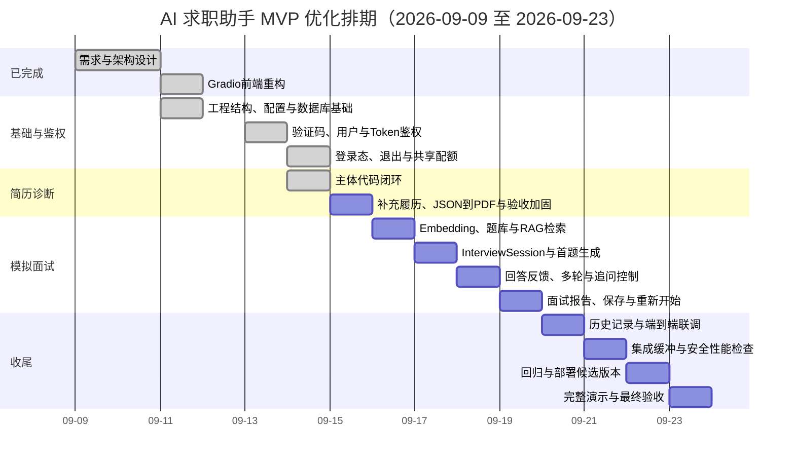

# AI 求职助手 MVP 项目排期表

---

## 1. 文档信息

| 项目 | 内容 |
| :--- | :--- |
| **项目名称** | AI 求职助手 MVP |
| **排期周期** | 2026年9月9日 - 2026年9月23日（共15个自然日） |
| **开发资源假设** | 1名开发者，全职；任务按关键路径串行推进 |
| **当前状态日期** | 2026年9月15日 |
| **MVP最终目标** | 完整演示：登录 → 简历诊断 → 模拟面试 → 历史记录 |
| **需求基线** | `需求与设计文档.md` v1 |

> 本排期以需求文档中的 P0、P1 为交付范围。独立的能力对标分析属于 P2，不作为 9月23日 MVP 验收阻塞项；面试报告中的逻辑、专业、表达评分仍按 P1 实现。

---

## 2. 排期调整原则

1. **按优先级交付**：先完成所有 P0，再完成影响闭环的 P1。
2. **按依赖串行推进**：基础设施 → 鉴权与配额 → 简历诊断 → RAG与模拟面试 → 历史记录 → 联调验收。
3. **每天形成可验证增量**：每项任务必须有交付物和验收结果，不以“代码已编写”作为完成标准。
4. **测试随功能同步完成**：模块测试进入各任务工时，最后两天只做回归、修复、部署和演示准备。
5. **控制MVP范围**：不开发支付系统、微信小程序、市场百分位能力对标以及非必要的复杂后台。

---

## 3. MVP范围

### 3.1 本期必须交付

| 模块 | 需求范围 | 优先级 | 主要需求编号 |
| :--- | :--- | :--- | :--- |
| 用户认证 | 手机号、6位验证码、5分钟有效、Mock输出、Token、退出 | P0/P1 | F-AUTH-01～06 |
| 配额管理 | 每日10次、诊断与面试共享、次日00:00重置 | P1 | F-QUOTA-01～04 |
| 简历诊断 | PDF上传解析、手动粘贴、评分、关键词、建议、STAR示例、补充履历、JSON/HTML/Playwright生成PDF | P0/P1 | F-RESUME-01～16 |
| 模拟面试 | 岗位/JD/简历输入、定制出题、多轮问答、追问、报告 | P0/P1 | F-INTERVIEW-01～11 |
| 历史记录 | 最近5条诊断和面试记录、时间、岗位、评分/轮数 | P1 | F-HISTORY-01～03 |
| 基础设施 | 配置、Prompt、LLM、Embedding、ChromaDB、SQLite、日志与异常处理 | 支撑项 | 架构与非功能需求 |

### 3.2 本期不交付

| 功能 | 需求级别 | 处理方式 |
| :--- | :--- | :--- |
| 市场百分位能力对标 | P2 | 放入MVP后迭代，不单独建立“能力分析”Tab |
| 支付系统 | P3 | 不开发，体验阶段人工管理 |
| 微信小程序/H5 | P3 | 不开发，仅保留未来通过 `gradio_client` 接入的能力 |
| Redis、PostgreSQL、独立管理后台 | 非MVP | 当前使用内存计数和SQLite，达到迁移条件后再升级 |

### 3.3 统一业务口径

| 项目 | MVP口径 |
| :--- | :--- |
| 配额计次 | 一次完整简历诊断计1次；一次新建模拟面试会话计1次；同一会话内回答与追问不重复计次 |
| 配额失败处理 | 输入校验失败不扣减；外部AI服务失败时不扣减或回滚本次占用 |
| 面试轮数 | 默认5道主问题；单道主问题最多追问3次 |
| 历史记录 | 分别展示最近5条简历诊断和模拟面试记录 |
| 能力评分 | 作为面试报告的一部分，统一为逻辑、专业、表达三个维度 |
| PDF兜底 | 解析失败或文本为空时，允许用户手动粘贴文本继续诊断 |

---

## 4. 当前进度基线

| 日期 | 已完成内容 | 状态 | 说明 |
| :--- | :--- | :--- | :--- |
| 9月9日 - 9月10日 | 需求文档、架构图、业务流程图和初始工程骨架 | 已完成 | 形成需求与设计基线 |
| 9月11日 | Gradio前端重构 | 已完成 | 登录页、用户栏、退出交互、三个功能Tab已建立；业务回调待接入 |
| 9月11日 | 后端工程与数据层初始化 | 已完成 | 模块化目录、环境配置、SQLite三张核心表、CRUD与测试已建立，原9月12日任务提前完成 |
| 9月12日 | 验证码和Token鉴权 | 已完成 | 验证码缓存、过期校验、Token生成/复用/校验和撤销已实现并通过测试，原9月13日任务提前完成 |
| 9月14日 | 登录态、退出与共享配额 | 已完成 | LocalStorage恢复与失效清理、退出撤销、每日共享配额、失败回滚和并发限制已实现；通过自动化与真实浏览器验收 |
| 9月14日 | 简历诊断主体代码 | 待验收 | PDF/文本输入、双解析兜底、AI诊断、SQLite保存、配额接入、STAR示例、优化稿编辑和Word导出已提前贯通；41个自动化测试通过，真实PDF与真实API验收安排在9月15日 |
| 9月15日 | 补充履历与PDF生成 | 条件通过 | 补充履历窗口、结构化JSON、固定HTML模板和Playwright A4 PDF已实现；62个测试、3页视觉检查和应用启动通过，真实API质量与耗时待验收 |

当前鉴权与配额闭环已完成，配额服务已经接入简历诊断主体代码。9月15日按 `今日开发计划-2026-09-15.md` 完成补充履历窗口、结构化JSON生成、HTML模板、Playwright PDF、异常回滚、浏览器闭环与性能验收；通过后关闭M3，并从9月16日起依次前移模拟面试相关任务。简历诊断验收未通过时，9月16日优先清理P0阻塞项，不带缺陷进入下一里程碑。

---

## 5. 优化后总排期

---

## 6. 每日任务与验收

| 日期 | 任务 | 交付物 | 当日验收标准 | 状态 |
| :--- | :--- | :--- | :--- | :--- |
| **9月9日** | 明确产品范围和用户流程 | 需求文档、用户流程 | P0/P1/P2边界可识别 | 已完成 |
| **9月10日** | 完成架构、模块、数据和异常流程设计 | 架构图、流程图 | 核心模块和数据流可追踪 | 已完成 |
| **9月11日** | 将示例页面重构为MVP前端壳 | 登录页、用户栏、3个Tab、退出交互 | 页面可启动，登录与主界面可切换 | 已完成 |
| **9月12日** | 建立模块化目录；实现配置加载、SQLite表与基础CRUD | `config/`、`modules/`、`models/`、`utils/`、数据库初始化 | 数据库可重复初始化；用户、诊断、面试记录可CRUD | 已提前完成（9月11日） |
| **9月13日** | 实现验证码和Token鉴权 | 验证码缓存、5分钟过期、Token生成/复用/校验 | 正确验证码可登录；错误或过期验证码被拒绝；已登录用户不重复生成Token | 已提前完成（9月12日） |
| **9月14日** | 接入前端登录态、LocalStorage、退出和共享配额 | 真实登录回调、Token传递、配额模块 | 刷新后可恢复有效登录；退出清理登录态；第11次核心调用被阻止 | 已完成 |
| **9月15日** | 增加补充履历窗口；按JSON → HTML → Playwright路线生成新版PDF简历 | JSON Schema、HTML/CSS模板、PDF生成器、补充窗口、边界/越权/失败/版式测试、M3验收结论 | 上传/粘贴 → 诊断 → 补充履历 → JSON → HTML → A4 PDF完整跑通；中文与分页正常；失败保留输入且不覆盖旧稿；全流程只计1次 | 条件通过；真实API待验收，见 `今日开发计划-2026-09-15.md` |
| **9月16日** | 实现Embedding、ChromaDB和面试题库初始化 | Embedding封装、向量库、题库导入脚本、检索测试 | 可批量写入题目；岗位+JD+简历查询能返回top 5相关问题 | 未开始；M3通过后启动 |
| **9月17日** | 实现InterviewSession和首题生成 | 会话状态模型、开始面试接口、首题页面 | 输入岗位后可建立独立会话；结合简历/JD/RAG结果生成第一题 | 未开始 |
| **9月18日** | 实现回答评价、反馈、动态追问和5题流程 | 多轮状态机、回答提交交互 | 追问不超过3次；主问题正确累计；会话之间状态隔离 | 未开始 |
| **9月19日** | 实现结束条件、面试报告、记录保存和重新开始 | 面试报告、持久化、重置流程 | 5题后生成逻辑/专业/表达评分、盲区和建议；记录可查；重开后状态清空 | 未开始 |
| **9月20日** | 实现历史记录；串联鉴权、配额、诊断和面试；补齐异常提示 | 我的记录Tab、端到端流程、异常处理 | 最近5条记录正确展示时间、岗位、评分/轮数；主流程无断点 | 未开始 |
| **9月21日** | 处理集成缓冲项并完成安全与性能检查 | 缺陷清单、性能记录、数据隔离与并发检查 | P0缺陷清零；诊断和面试响应时间、用户隔离、并发行为均有验证记录 | 未开始 |
| **9月22日** | 回归测试、部署配置和候选版本验收 | 测试报告、部署说明、可运行候选版本 | 核心用例通过；服务可从干净环境启动；候选版本冻结 | 未开始 |
| **9月23日** | 完整演示、最终修复和交付 | 演示脚本、最终版本、已知限制清单 | 完成一次全链路演示；无阻塞问题；交付物齐全 | 未开始 |

---

## 7. 模块交付标准

### 7.1 用户认证与配额

- [x] 支持11位手机号校验。
- [x] 生成6位数字验证码并打印到服务端控制台。
- [x] 验证码5分钟后失效，错误验证码允许重试。
- [x] 登录成功后生成并复用有效Token。
- [x] 后续核心操作能够通过Token识别用户，用户数据相互隔离。
- [x] 支持退出登录并清理浏览器登录态。
- [x] 简历诊断与模拟面试共享每日10次配额，次日00:00重置。

### 7.2 简历诊断

- [ ] 支持上传不超过12MB的PDF。
- [ ] 使用PyPDF2和pdfplumber提取文本，并完成基础清洗。
- [ ] PDF解析失败或内容为空时允许手动粘贴文本。
- [ ] 用户必须填写目标岗位后才能开始诊断。
- [ ] 结果包含0-100评分、缺失关键词、具体建议和STAR改写示例。
- [ ] 点击“生成新版简历”先打开补充履历窗口，支持取消、留空直接生成和确认补充后生成。
- [ ] 补充履历最多6000字；失败时保留输入和上一版优化稿。
- [ ] AI只使用原简历和补充履历中的事实，不执行补充文本中的指令，不虚构经历或数据。
- [ ] AI输出通过JSON Schema校验；字段经转义后进入固定HTML/CSS模板，不执行模型输出的HTML。
- [ ] Playwright生成可下载的A4 PDF；中文、长经历分页、页边距和链接打印正常。
- [ ] 同一次诊断中的新版PDF生成、失败重试和下载不重复扣配额。
- [ ] 诊断结果保存到SQLite，并支持重新诊断。
- [ ] 正常网络条件下单次诊断响应时间不超过30秒。

### 7.3 模拟面试

- [ ] 支持输入或选择岗位，JD和简历内容为可选输入。
- [ ] RAG返回top 5相关面试题，AI据此生成定制化首题。
- [ ] 用户提交回答后获得反馈；不充分时自动追问。
- [ ] 单题最多追问3次，默认完成5道主问题。
- [ ] 报告包含逻辑、专业、表达评分，以及知识盲区和改进建议。
- [ ] 面试结果和轮次保存到SQLite，并支持重新开始。
- [ ] 正常网络条件下单轮响应时间不超过15秒。

### 7.4 历史记录

- [ ] 展示当前用户最近5条简历诊断记录。
- [ ] 展示当前用户最近5条模拟面试记录。
- [ ] 记录包含创建时间、目标岗位，以及评分或问答轮数。
- [ ] 用户不能查询其他用户的记录。

---

## 8. 里程碑与退出条件

| 里程碑 | 日期 | 退出条件 |
| :--- | :--- | :--- |
| **M1：前端骨架完成** | 9月11日 | 新版登录页和3个功能Tab可运行 |
| **M2：鉴权与配额闭环** | 9月14日 | 登录、Token、退出、每日共享配额完整跑通 |
| **M3：简历诊断闭环** | 9月15日 | 上传/粘贴、AI诊断、补充履历、JSON Schema、HTML模板、Playwright PDF和下载完整跑通，且有真实输入、事实边界、失败恢复与PDF视觉验收证据 |
| **M4：模拟面试闭环** | 9月19日 | RAG出题、5题多轮问答、追问、报告和保存完整跑通 |
| **M5：端到端集成完成** | 9月20日 | 历史记录可查，四个模块完成端到端串联 |
| **M5.5：MVP候选版本** | 9月22日 | 安全性能检查和回归通过，可从干净环境启动 |
| **M6：验收版本** | 9月23日 | 回归通过、部署可启动、完整演示成功 |

任一里程碑只有在对应验收用例通过后才能标记完成。未完成的P1可以在不破坏P0主流程的前提下降级，但必须记录为已知缺口；P0未完成时不得将版本标记为MVP验收通过。

---

## 9. 测试与验收计划

### 9.1 核心测试集

| 类别 | 必测场景 |
| :--- | :--- |
| 鉴权 | 合法/非法手机号、正确/错误/过期验证码、重复登录Token复用、无效Token、退出 |
| 配额 | 首次使用、第10次、第11次、跨日重置、AI失败不扣减、两个功能共享次数 |
| PDF | 正常PDF、非PDF、超过12MB、扫描件或空文本、中文文本、手动粘贴兜底 |
| 诊断 | 必填校验、正常结构化输出、LLM非JSON输出、API超时、结果保存和重新诊断 |
| 面试 | 无JD/无简历、定制首题、充分回答、不充分回答、追问上限、5题结束、重新开始 |
| 历史 | 无记录、有记录、超过5条、用户隔离、按时间倒序 |
| 系统 | 页面加载、并发队列、SQLite写入、服务重启、外部API错误提示 |

### 9.2 最终验收路径

### 9.3 非功能验收

| 指标 | 目标 | 验证方式 |
| :--- | :--- | :--- |
| 页面加载 | 不超过3秒 | 本地和部署环境各测3次 |
| 简历诊断 | 不超过30秒 | 记录5次真实API调用耗时 |
| 面试单轮 | 不超过15秒 | 记录至少10轮调用耗时 |
| 并发 | 支持50个在线用户 | 验证Gradio队列配置；进行基础并发测试并记录环境限制 |
| 数据隔离 | Token仅访问当前用户数据 | 两个测试账号交叉查询 |
| 可维护性 | 单文件不超过400行 | 自动统计Python文件行数 |
| 成本 | 月度成本不超过200元 | 记录模型、Embedding和服务器用量估算 |

---

## 10. 风险、触发条件与降级方案

| 风险 | 触发条件 | 优先处理 | 降级方案 |
| :--- | :--- | :--- | :--- |
| LLM响应不稳定 | 超时、限流或输出无法解析 | 重试和结构化解析兜底 | 切换备用模型；保留用户输入，不扣配额 |
| 补充履历包含提示注入或虚假信息 | 用户输入试图改写系统约束，或模型生成材料外事实 | 将补充内容标记为不可信事实材料；输出做人工与自动检查 | 保留上一版优化稿，提示用户核对后再导出 |
| Embedding或ChromaDB接入延期 | 9月18日未完成可用检索 | 保证面试主流程 | 使用按岗位分类的本地题库召回，RAG完善列入后续修复 |
| PDF解析准确率不足 | 测试PDF无法提取有效文本 | 保证诊断可继续 | 明确提示并自动展示手动粘贴入口 |
| 浏览器登录态受Gradio限制 | LocalStorage集成不稳定 | 保证当前会话鉴权 | 先使用会话状态，记录刷新后重新登录的已知限制 |
| SQLite并发写锁 | 并发测试出现锁异常 | 缩短事务并增加重试 | 保持单进程队列，后续迁移PostgreSQL |
| 开发进度延期 | 任一关键里程碑延误超过1天 | 保住P0和主闭环 | 依次降级：雷达图可视化、报告导出、备用模型自动切换、RAG增强；不删除报告文字内容和历史记录 |

---

## 11. MVP后迭代池

| 优先顺序 | 功能 | 进入条件 |
| :--- | :--- | :--- |
| 1 | 能力对标与市场百分位分析 | 有足够真实诊断和面试样本后设计基准数据 |
| 2 | 报告导出 | MVP主流程稳定后补充PDF或Markdown导出 |
| 3 | Redis配额与验证码缓存 | 多进程部署或内存状态不可接受时 |
| 4 | PostgreSQL迁移 | 用户量或并发写入超过SQLite承载范围时 |
| 5 | 微信小程序/H5 | Web MVP验证留存与使用频率后 |
| 6 | 支付系统 | 商业模式和付费意愿验证后 |
| 7 | 结构化补充履历、附件解析和长期个人履历档案 | 轻量补充窗口验证使用率和生成质量后 |

---

## 12. 最终交付物

| 序号 | 交付物 | 验收状态 |
| :--- | :--- | :--- |
| 1 | 可运行的Gradio前端：登录页、简历诊断、模拟面试、我的记录 | 待验收 |
| 2 | 用户认证与每日共享配额模块 | 待验收 |
| 3 | PDF解析、简历诊断与STAR优化模块 | 待验收 |
| 4 | Embedding、ChromaDB题库检索与模拟面试模块 | 待验收 |
| 5 | 面试报告与历史记录模块 | 待验收 |
| 6 | 统一Prompt、LLM和Embedding调用封装 | 待验收 |
| 7 | SQLite数据文件初始化及CRUD实现 | 待验收 |
| 8 | 核心测试报告和已知限制清单 | 待验收 |
| 9 | 部署配置、启动说明和完整演示脚本 | 待验收 |

---

**排期版本**：v4
**最后更新**：2026年9月14日
